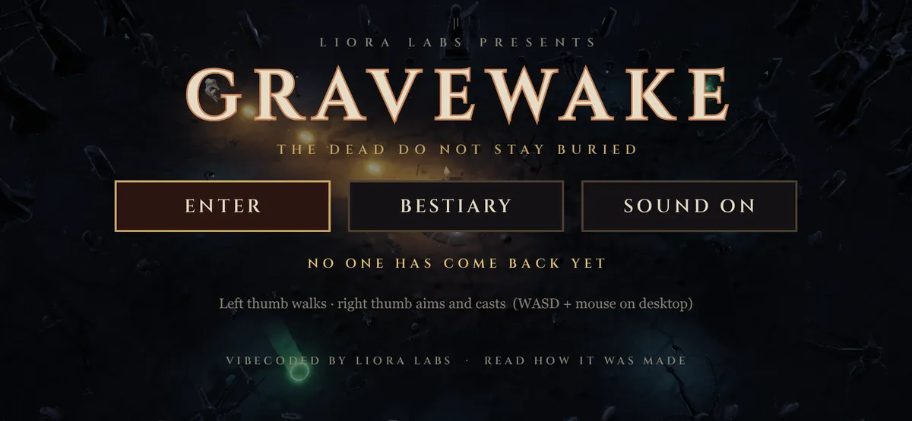
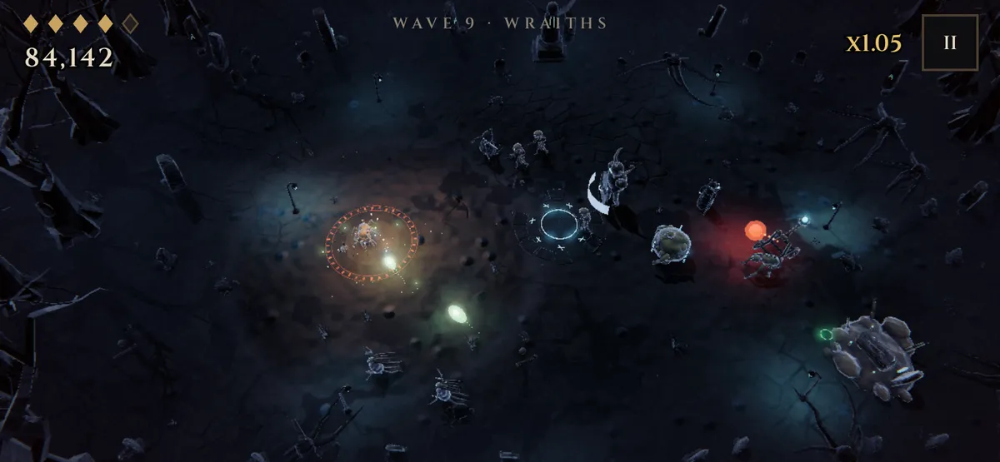

# GRAVEWAKE

A dark fantasy twin-stick shooter for phones. You are a wizard alone in a dead clearing at midnight, and the dead are climbing out of the ground.

GRAVEWAKE is an experiment in vibecoding video games with Opus 5.5, by [Liora Labs](https://lioralabs.dev): one prompt for the first playable game, a handful more to reshape it, and a set of house rules that kept every change readable along the way.

- **Read the story:** [Agentic Speed, Human Control in Game Dev](https://lioralabs.dev/blog/agentic-speed-human-control)
- **Play it:** [shiny-guru.itch.io/gravewake](https://shiny-guru.itch.io/gravewake)
- **The house rules:** the [game-bible plugin](https://github.com/LioraLabs/claude-plugins/tree/main/plugins/game-bible) for Claude Code





## Play

Hold the phone in landscape. Your left thumb walks, your right thumb aims and casts: each stick appears wherever your thumb lands. On desktop, WASD moves and the mouse aims and casts. Between waves, pick a boon. Survive the Lich at wave 5 and the Bone Colossus after.

Installed from the browser's "Add to Home Screen", it runs fullscreen as an app.

## Where things live

Everything a designer might want to change lives in a readable file, not in the source. That promise is the game's **tweak map**, and `docs/declarative-ui.md` is its catalog: every word, token and model, checked against the code by a test.

| Change | File |
|---|---|
| The undead: names, health, speed, how they fight | `content/enemies.kdl` |
| Waves: who comes, when, how many | `content/waves.kdl` |
| Boons between waves | `content/upgrades.kdl` |
| The clearing: trees, graves, ruins, lanterns | `content/arena.kdl` |
| Sound effects and the mix | `content/sounds.kdl` |
| Every colour, and how the night looks (fog, moonlight, glow) | `src/screens/shared.css` `:root` (`--look-*` tokens) |
| Screens: what's on them, and how they look | `src/screens/<screen>.kdl` and `.css` |
| Numbers the rules read: speeds, timings, drop chances | `src/tuning.ts` |
| Models and their animations | `models/<name>.py` (Blender scripts) |

An enemy is a few properties plus a handful of behaviour words:

```kdl
enemy "lich" name="The Lich" tier="boss" hp=260 r=2 score=2000 model="lich" spawns="banshee" ... {
    keep-away 7 1.4
    spiral 0.18 4
    burst 3.2 9 80
    summon 7 3
}
```

## Develop

```sh
npm install
npm run dev            # the game, on your LAN too (open it on a phone)
npm run storybook      # every screen, enemy and model as a story
npm test               # unit tests (rules, content, guards, catalog)
npm run test:stories   # every story's play function in headless Chromium
npm run sim            # a bot plays 30 runs and reports what killed it
npm run build          # a static build in dist/, relative paths (runs from any folder)
```

The rules are a pure functional core (`src/game.ts`, `src/enemies.ts`, `src/upgrades.ts`); rendering, input and audio are a thin shell around it (`src/view/`, `src/screens/`, `src/input.ts`, `src/audio.ts`).

### Models

Every model is a Python script in `models/` that runs in headless Blender and exports glTF. The exported `.glb` files are committed, so building the game doesn't need Blender; rebuilding the models does:

```sh
npm run models             # all of them
npm run models -- lich     # just one
```

## License

MIT, see [LICENSE](LICENSE). The Cinzel font is used under the SIL Open Font License via `@fontsource/cinzel`.
